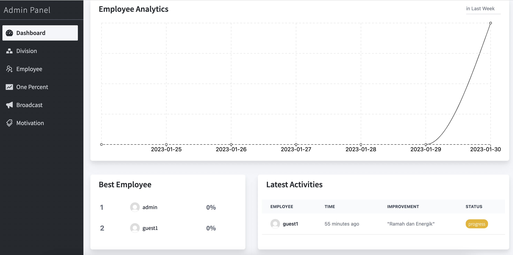

# One Percent Improvement - Client Side (Admin)
Aplikasi One Percent Improvement (admin) merupakan aplikasi sederhana pengembangan diri untuk memonitor karyawan pada suatu perusahaan. Admin bisa membuat, mengedit, mengaktifkan / menonaktifkan akun karyawan, broadcast, divisi, motivasi. Admin dapat melihat 7 karyawan dengan presentase improvement tertinggi, data improvement baru yang diinputkan karyawan.

Aplikasi One Percent Improvement menggunakan ReactJS, Tailwind CSS, Context pada bagian Admin.




#### Account :
```sh
username: admin
password: 123456
```

### Follow this step :
- Buka Terminal pada lokasi folder project client side (admin)
- Ketikkan `npm install`
- Buka file .env dan edit sesuaikan dengan endpoint server
- Setelah itu ketikkan `npm run start`